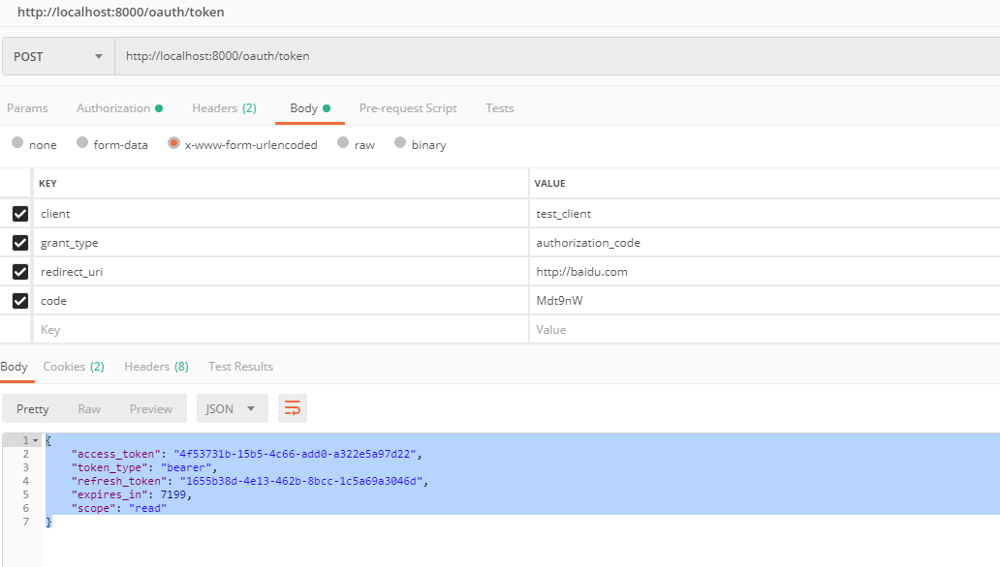

1. 授权服务器验证

http://127.0.0.1:8000/oauth/authorize?client_id=test_client&response_type=code&redirect_uri=http://baidu.com

2. 输入账号密码，为实现的 UserDetailsService 要里获取的用户，点击 login,
3. 进入简单授权页面，点击 Authorize,
4. 重定向到 redirect_uri，并带有 code 参数: 

    http://baidu.com?code=rTKETX

5. POST请求获取token

http://localhost:8000/oauth/token

参数:
* client
* grant_type: authorization_code
* redirect_uri
* code

请求头：

Authorization: 

注意，此处需加 Authorization 请求头，值为 Basic xxx xxx 为 client_id:client_secret 的 base64编码。

